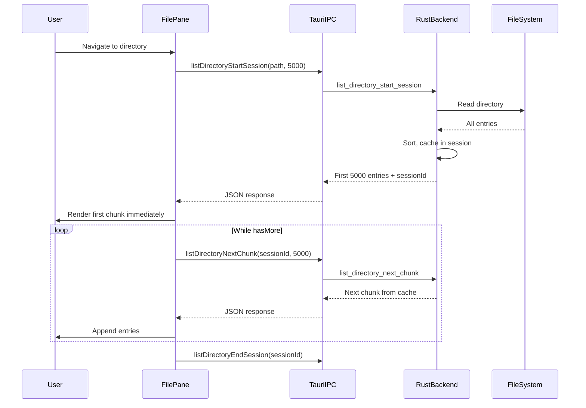

# File loading

How directory listings are loaded, from user action to rendered list.

## Overview

When a user navigates to a directory, the app:

1. Reads the directory contents from disk (Rust)
2. Transfers the data to the frontend (Tauri IPC with JSON)
3. Renders the file list progressively (Svelte)

For large directories (50k+ files), this uses **cursor-based pagination** to show the first chunk immediately while
loading the rest in the background.

## Architecture diagram

## Data flow layers

### 1. Frontend: FilePane.svelte

The
[FilePane](file:///Users/veszelovszki/Library/CloudStorage/Dropbox/projects-git/vdavid/rusty-commander/src/lib/file-explorer/FilePane.svelte)
component orchestrates directory loading.

**Key function:** `loadDirectory(path, selectName?)`

1. Shows loading state
2. Calls `listDirectoryStartSession()` to get first chunk
3. Renders first chunk immediately
4. Calls `listDirectoryNextChunk()` in a loop for remaining data
5. Uses `requestAnimationFrame()` between chunks to keep UI responsive
6. Calls `listDirectoryEndSession()` to clean up

**Reactivity optimization:** The file list is stored in a plain array (`allFilesRaw`) rather than Svelte's `$state` to
avoid the overhead of making 50k objects reactive. A simple counter (`filesVersion`) triggers updates.

### 2. IPC layer: tauri-commands.ts

The
[tauri-commands](file:///Users/veszelovszki/Library/CloudStorage/Dropbox/projects-git/vdavid/rusty-commander/src/lib/tauri-commands.ts)
module provides typed wrappers for Rust commands.

**Session API functions:**

- `listDirectoryStartSession(path, chunkSize)` → `SessionStartResult`
- `listDirectoryNextChunk(sessionId, chunkSize)` → `ChunkNextResult`
- `listDirectoryEndSession(sessionId)` → void

For serialization format rationale, see
[ADR 007: Use JSON for Tauri IPC](file:///Users/veszelovszki/Library/CloudStorage/Dropbox/projects-git/vdavid/rusty-commander/docs/adr/007-json-for-ipc.md).

### 3. Rust commands: commands/file_system.rs

The
[file_system commands](file:///Users/veszelovszki/Library/CloudStorage/Dropbox/projects-git/vdavid/rusty-commander/src-tauri/src/commands/file_system.rs)
expose Tauri commands that call the file system operations.

**Commands:**

- `list_directory_start_session` - Starts a session, reads directory, caches entries, returns first chunk
- `list_directory_next_chunk` - Returns next chunk from cache
- `list_directory_end_session` - Cleans up the session cache

### 4. File system operations: file_system/operations.rs

The
[operations module](file:///Users/veszelovszki/Library/CloudStorage/Dropbox/projects-git/vdavid/rusty-commander/src-tauri/src/file_system/operations.rs)
contains the core logic.

**Session cache:** A static `HashMap<String, CachedDirectory>` stores directory listings keyed by session ID. Sessions
expire after 60 seconds to prevent memory leaks.

**Key function:** `list_directory(path)`

1. Reads directory entries with `fs::read_dir()`
2. Extracts metadata (size, permissions, timestamps)
3. Resolves owner/group names (with caching)
4. Generates icon IDs
5. Sorts: directories first, then files, both alphabetically

## Latency breakdown (50k files)

Based on benchmarks on a MacBook Pro M1:

| Step                    | Time        | Notes                             |
| ----------------------- | ----------- | --------------------------------- |
| Rust `list_directory()` | ~300ms      | Disk I/O + metadata extraction    |
| JSON serialization      | ~18ms       | 17 MB payload                     |
| IPC transfer            | ~1.4s       | WebView JSON parsing              |
| Svelte reactivity       | ~50ms       | With optimized non-reactive array |
| **First chunk visible** | **~350ms**  | User sees files quickly           |
| **Full list loaded**    | **~2-2.5s** | Competitive with Commander One    |

## Configuration

**Chunk size:** 5000 entries (defined in `FilePane.svelte`)

This balances:

- Time to first content (smaller = faster)
- Number of IPC calls (larger = fewer calls)
- Memory overhead (larger = more cached)

## Key design decisions

1. **JSON over MessagePack** - Native JSON is faster through Tauri's IPC. See
   [ADR 007](file:///Users/veszelovszki/Library/CloudStorage/Dropbox/projects-git/vdavid/rusty-commander/docs/adr/007-json-for-ipc.md).

2. **Session-based caching** - Directory is read once, chunks served from memory. Avoids O(n²) re-reading.

3. **Non-reactive file array** - Svelte's `$state` on 50k objects caused ~9.5s overhead. Using a plain array with manual
   reactivity trigger reduced this to ~50ms.

4. **Progressive rendering** - First chunk appears in ~350ms. Remaining chunks load without blocking the UI.

## Future improvements

- **Virtual scrolling** - Only render visible rows (phase 4)
- **Lazy metadata loading** - Load only names first, fetch metadata on demand
- **File system watcher** - Auto-refresh on external changes
- **Cancellation** - Cancel in-progress directory reads when navigating away
